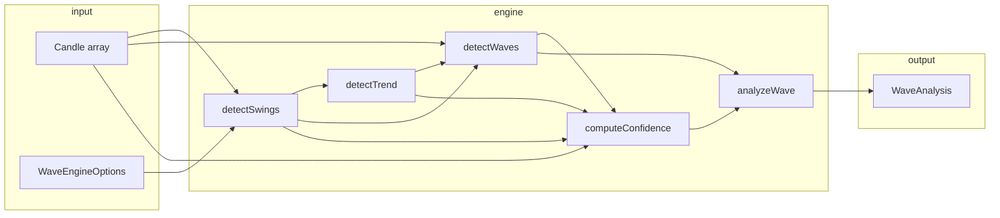
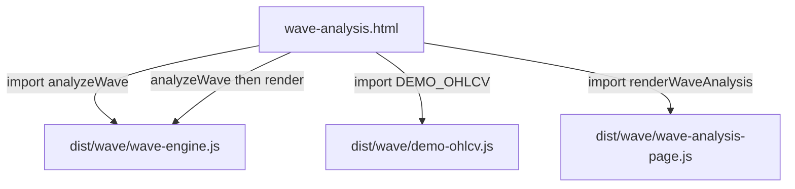

# Kripto Projects — Proje Çalışma Dokümanı

Bu belge, `kripto-projects` deposunda **şu ana kadar** yapılan geliştirmeleri, mimariyi, test/build süreçlerini ve bilinen tasarım kararlarını özetler. Hem mevcut Binance WebSocket istemcisini hem de eklenen **Wave Engine** modülünü ve **browser demo** entegrasyonunu kapsar.

**Son güncelleme bağlamı:** Wave Engine Checkpoint 3 tamamlandı (browser bundle + anlamlı demo OHLCV). `crypto-dashboard.html`, `sw.js`, `manifest.json` ve Binance istemci koduna Wave entegrasyonu **henüz** yapılmadı.

---

## 1. Proje özeti

| Bileşen | Amaç | Ortam |
|--------|------|--------|
| **Binance Futures WS Client** | BTCUSDT (yapılandırılabilir) için `bookTicker` + 1m kline, otomatik reconnect | Node.js |
| **Wave Engine** (`src/wave/`) | OHLCV üzerinde swing, trend, Elliott-tarzı impulse (1–5) ve corrective (A–B–C) adayları, güven skoru | Pure TypeScript (Node test + browser bundle) |
| **wave-analysis.html** | Wave Engine’i tarayıcıda mock veriyle gösterme | Statik HTML + ESM |

Tasarım ilkesi: Wave Engine **Binance’e, DOM’a, IndexedDB’ye ve framework’e bağımlı değil**; sadece `Candle[]` ve opsiyonel `WaveEngineOptions` alır.

---

## 2. Repository yapısı (özet)

```
kripto-projects/
├── src/
│   ├── index.ts                    # Binance demo giriş noktası
│   ├── BinanceFuturesClient.ts
│   ├── ReconnectingWebSocket.ts
│   ├── types.ts                    # Binance normalize tipleri
│   ├── wave/                       # Wave Engine Core (algoritma)
│   │   ├── index.ts                # analyzeWave() + re-export’lar
│   │   ├── types.ts
│   │   ├── swing-detector.ts
│   │   ├── trend-detector.ts
│   │   ├── wave-detector.ts
│   │   ├── fibonacci.ts
│   │   ├── confidence.ts
│   │   └── __tests__/              # 24 unit test
│   └── browser/                    # Sadece demo/UI (engine’e DOM yok)
│       ├── demo-ohlcv.ts
│       └── wave-analysis-page.ts
├── dist/                           # tsc (Node) + wave browser bundle
│   └── wave/
│       ├── wave-engine.js
│       ├── demo-ohlcv.js
│       └── wave-analysis-page.js
├── scripts/
│   └── build-wave-browser.mjs      # esbuild
├── wave-analysis.html              # Browser demo sayfası
├── crypto-dashboard.html           # Dokunulmadı (mevcut PWA/dashboard)
├── sw.js, manifest.json            # Dokunulmadı
├── package.json
├── tsconfig.json
└── docs/
    └── PROJE_CALISMA_DOKUMANI.md   # Bu dosya
```

---

## 3. Binance Futures WebSocket istemcisi (mevcut)

### 3.1 Modüller

- **`ReconnectingWebSocket`:** Genel amaçlı sarmalayıcı; exponential backoff (1s → max 30s), heartbeat/timeout ile donmuş bağlantıyı kesip yeniden bağlanma.
- **`BinanceFuturesClient`:** Futures stream URL, abonelik, ham mesajın normalize edilmesi.
- **`src/index.ts`:** `SYMBOL`, `KLINE_INTERVAL` sabitleri; her mesajı Türkçe alan adlarıyla JSON olarak konsola yazdırır.

### 3.2 Çalıştırma

```bash
npm install
npm run dev      # tsx ile derlemeden
npm run build && npm start
```

### 3.3 npm / kurulum notu

npm 11.x ile `esbuild` (tsx bağımlılığı) için **install script** uyarısı görülebilir. Çözüm: `package.json` içinde `allowScripts` ile `esbuild@0.28.2` onaylandı veya `npm install-scripts approve esbuild`. Bu, Wave Engine ile doğrudan ilgili değildir; geliştirme araç zinciri içindir.

---

## 4. Wave Engine — mimari

### 4.1 Veri akışı



### 4.2 Ana API: `analyzeWave(candles, options?)`

`src/wave/index.ts` içinde:

1. Boş mum → `NEUTRAL`, boş dalga listesi, confidence `0`.
2. `detectSwings` → onaylı/onaysız swing noktaları (repainting: sağ bar sayısı dolmadan `confirmed: false`).
3. `detectTrend` → `BULLISH` | `BEARISH` | `NEUTRAL`.
4. `detectWaves` → impulse (1–5), corrective (A–B–C), alternatif senaryo listesi.
5. `computeConfidence` → 0–100 genel skor; dalga bazlı `applyPerWaveConfidence`.
6. `currentWaveLabel`, `primaryInvalidationPrice` ile zenginleştirilmiş `WaveAnalysis`.

### 4.3 Modül sorumlulukları

| Dosya | Görev |
|-------|--------|
| `swing-detector.ts` | Pivot high/low (sol/sağ bar penceresi), ATR, prominence, `computeSwingStrength` (0–100) |
| `trend-detector.ts` | HH/HL/LH/LL sınıflandırma; trend kararı |
| `wave-detector.ts` | 6 pivotluk zincirden impulse; 9 pivotla A–B–C; bull/bear skor; Wave 2 invalidation, Wave 3 expansion, Wave 4 overlap |
| `fibonacci.ts` | Retracement/extension seviyeleri ve uyum skoru |
| `confidence.ts` | Ağırlıklı skor: structure 40%, fibonacci 15%, trend 15%, momentum 10%, volume 10%, swing quality 10% |
| `types.ts` | `Candle`, `SwingPoint`, `WaveCandidate`, `WaveAnalysis`, varsayılan swing config (`leftBars/rightBars: 5`, `atrPeriod: 14`, `minAtrMultiplier: 0.5`) |

### 4.4 Varsayılan swing ayarları vs test/demo

Üretim benzeri varsayılanlar daha muhafazakâr (5/5 bar, 0.5 ATR çarpanı). Unit testler ve browser demo, sentetik veride pivot üretmek için gevşetilmiş ayar kullanır: `leftBars/rightBars: 2`, `minAtrMultiplier: 0.05`.

---

## 5. Geliştirme aşamaları (checkpoint’ler)

### Checkpoint 1 — Wave Engine Core

- `src/wave/` altında pure TypeScript motoru implemente edildi.
- Swing, trend, wave, fibonacci, confidence modülleri ve `analyzeWave` birleşik API’si.
- `src/wave/__tests__/` altında **24 test** (confidence, swing-detector, trend-detector, wave-detector).
- `npm test` → `tsx --test src/wave/__tests__/**/*.test.ts`
- `tsconfig.json`: test dosyaları ve `src/browser/**` Node `tsc` build’inden exclude.

### Checkpoint 2 — Trend detector düzeltmesi

**Problem:** `returns NEUTRAL when structure mixed` testi başarısız; algoritma `BEARISH` döndürüyordu.

**Kök neden:** Son iki tepe/dip `LH + LL` üretiyordu; kod bunu doğrudan ayı trendi sayıyordu. Test senaryosu ise serinin **son onaylı swing’inin HIGH** (düzeltme/tepki) olduğu, yapı etiketleri ayı olsa bile trendin henüz teyit edilmediği **karışık** rejimi modelliyordu.

**Minimal düzeltme** (`trend-detector.ts` — yalnızca `detectTrend`):

- **BULLISH:** `HH + HL` **ve** son onaylı swing `HIGH`
- **BEARISH:** `LH + LL` **ve** son onaylı swing `LOW`
- Aksi → **NEUTRAL**

`classifyHighStructure` / `classifyLowStructure` değiştirilmedi. Test beklentileri değiştirilmedi. Sonuç: **24/24** test geçti.

### Checkpoint 3 — Browser build + wave-analysis.html

**Amaç:** Motoru tarayıcıdan ESM olarak çağırmak; dashboard’a dokunmadan bağımsız demo sayfası.

**Build:**

- `npm run build` → yalnızca `tsc` (CommonJS, Node) — **davranış korundu**.
- `npm run build:wave-browser` → `scripts/build-wave-browser.mjs` + **esbuild** (zaten `tsx` ile gelir, ekstra npm paketi eklenmedi).

** çıktılar:**

| Bundle | Kaynak |
|--------|--------|
| `dist/wave/wave-engine.js` | `src/wave/index.ts` |
| `dist/wave/demo-ohlcv.js` | `src/browser/demo-ohlcv.ts` |
| `dist/wave/wave-analysis-page.js` | `src/browser/wave-analysis-page.ts` |

**Sayfa:** `wave-analysis.html` — kartlar (Trend, Current Wave, Confidence, Invalidation), dalga listesi, alternatif senaryolar, `<pre id="analysis-json">`.

**İlk demo veri sorunu:** `Math.sin` tabanlı seri browser’da çoğu zaman **0 detected wave**, düşük confidence ve `NEUTRAL` trend veriyordu; entegrasyon çalışıyordu ama demo anlamsızdı.

### Checkpoint 3 (devam) — Demo OHLCV doğrulaması

**Çözüm:** `demo-ohlcv.ts` yeniden yazıldı:

- Fiyat seviyeleri `wave-detector.test.ts` fixture’ı ile hizalı: `bullishImpulseSwings(110, 128)` + A–B–C (140 / 148 / 132).
- Bar index’leri **+2 kaydırıldı** (swing detector `leftBars/rightBars = 2` iken bar 0 pivot olamaz).
- Pivotlar arası lineer close, pivot barlarında yapay wick, komşu barlarda margin ile sahte pivot engelleme — tamamen **deterministik**, rastgele yok.

**Örnek `analyzeWave` çıktısı (mock):**

| Alan | Tipik değer |
|------|-------------|
| Trend | `BEARISH` (seri son LOW ile biter; LH+LL + son swing LOW) |
| Current Wave | `C` |
| Confidence | ~68 |
| Waves | `1,2,3,4,5,A,B,C` |
| Alternative scenarios | 1 (bull/bear impulse skor karşılaştırması) |
| Invalidation | Genelde yok (geçerli Wave 2 senaryosu) |

---

## 6. Browser entegrasyon mimarisi



**Önemli:** DOM yalnızca `src/browser/wave-analysis-page.ts` içinde. Wave Engine bundle’ı DOM veya `window` kullanmaz.

### Manuel test

```bash
npm run build:wave-browser
npx serve -p 3456 .
# http://localhost:3456/wave-analysis.html
```

`file://` ile açmak ESM/CORS nedeniyle önerilmez; basit HTTP sunucusu gerekir.

---

## 7. Test suite özeti

| Suite | Dosya | Konu |
|-------|--------|------|
| confidence | `confidence.test.ts` | Ağırlık toplamı 100, skor aralığı, invalidation, `analyzeWave` confidence |
| swing-detector | `swing-detector.test.ts` | Pivot, confirmed, repainting, strength ayrımı |
| trend-detector | `trend-detector.test.ts` | HH/HL/LH/LL, BULLISH/BEARISH/NEUTRAL (mixed + son swing tipi) |
| wave-detector | `wave-detector.test.ts` | Impulse 1–5, invalidation, Wave 4, A–B–C, Wave 3 potential |

```bash
npm test
```

Beklenen: **24 passed**, 0 failed.

---

## 8. Build komutları

| Komut | Ne yapar |
|-------|----------|
| `npm run build` | `tsc` → `dist/` (Node client + `dist/wave/*.js` CommonJS modülleri) |
| `npm run build:wave-browser` | esbuild → `dist/wave/*.js` (ESM, browser) |
| `npm run dev` | Binance client, tsx |
| `npm start` | `node dist/index.js` |
| `npm test` | Wave Engine unit testleri |

Browser demo için her `demo-ohlcv.ts` değişikliğinden sonra `build:wave-browser` yenilenmelidir.

---

## 9. Kısıtlar ve bilinçli olarak yapılmayanlar

Aşağıdakiler **kasıtlı olarak** henüz uygulanmadı veya dokunulmadı:

- `crypto-dashboard.html` içine Wave Engine gömme
- Binance canlı mum → `analyzeWave` pipeline
- Scanner, alarm, AI, Entry/SL/TP
- Wave Engine içine Binance/DOM/IndexedDB/framework bağımlılığı
- `sw.js` / `manifest.json` değişikliği

Wave Engine, ileride dashboard veya başka bir UI katmanına **sadece bundle veya npm modül** olarak bağlanabilir; çekirdek bu ayrım için korunuyor.

---

## 10. Tasarım kararları (özet)

1. **İki ayrı build hattı:** Node (tsc/CJS) vs browser (esbuild/ESM) — tek `tsconfig` ile browser’ı zorlamak yerine minimal esbuild script.
2. **Trend teyidi:** Yapı etiketleri (HH/HL vb.) tek başına yeterli değil; son swing tipi ile birlikte değerlendirilir (repaint sonrası tepki senaryoları).
3. **Demo veri:** Unit test fixture’larına hizalama, swing penceresi kısıtına index kaydırma — “gerçek piyasa” yerine “motorun yeteneğini gösterme”.
4. **Güven skoru:** Çok bileşenli; düşük skor demo’da kötü motor anlamına gelmez — veri ve swing ayarına duyarlıdır.
5. **Repainting:** Swing’ler `rightBars` dolana kadar `confirmed: false`; canlı grafikte ileride bu semantik korunmalı.

---

## 11. `WaveAnalysis` çıktı referansı

```typescript
interface WaveAnalysis {
  trend: "BULLISH" | "BEARISH" | "NEUTRAL";
  currentWave?: "1" | "2" | "3" | "4" | "5" | "A" | "B" | "C";
  waves: WaveCandidate[];
  confidence: number;              // 0–100
  invalidationPrice?: number;
  alternativeScenarios: WaveCandidate[][][];
}
```

Her `WaveCandidate`: `label`, `startIndex`, `endIndex`, `confidence`, `status` (`POTENTIAL` | `CONFIRMED` | `INVALIDATED`), opsiyonel `invalidationPrice`, `structureConflict`.

---

## 12. İleriye dönük olası adımlar (öneri, taahhüt değil)

1. Dashboard’a opsiyonel modül: kline buffer → `Candle[]` → `analyzeWave` (ayrı UI dosyası).
2. `npm run build` post-step veya CI’da `build:wave-browser`.
3. İkinci demo dataset: yalnızca impulse 1–5, son bar `HIGH` → `BULLISH` trend gösterimi.
4. `README.md` içine Wave Engine ve `wave-analysis.html` bölümü eklenmesi (bu dokümanla çapraz referans).

---

## 13. Hızlı referans — önemli dosya yolları

| Ne arıyorsunuz | Nerede |
|----------------|--------|
| Ana analiz fonksiyonu | `src/wave/index.ts` → `analyzeWave` |
| Trend kuralları | `src/wave/trend-detector.ts` → `detectTrend` |
| Browser demo verisi | `src/browser/demo-ohlcv.ts` |
| Demo sayfası | `wave-analysis.html` |
| Browser build script | `scripts/build-wave-browser.mjs` |
| Binance giriş | `src/index.ts` |

---

*Bu doküman, konuşma ve checkpoint sürecinde yapılan işlerin teknik özetidir. Kod değiştiğinde özellikle demo pivot tablosu ve test sayısı bu dosyada güncellenmelidir.*
